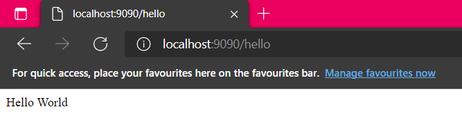

# ASMVC

> ASMVC is a project created by Albet Novendo. Intended for your simple web projects that based on MVC. ASMVC itself is
> a sort of A Simple MVC

> Docs Version: 1.x

## Quick Start

> Installing ASMVC

ASMVC can be installed by:

```bash
composer create-project albet/asmvc project-folder-name -s dev
```

> Displaying Hello World

Goto url.php located in below:

```text
.
└── App
    └── Router
        ├── url.php
```

Add following line:

```php
Route::inline("/hello", function() {
    echo "Hello World";
});
```

at the bottom of the `url.php` file.

Now serve the app by running:

```console
php asmvc serve
```

You should be greeted by display like this while you're accessing `localhost:9090/hello` url:



> Next: [ENV Configuration](/envconfig)
