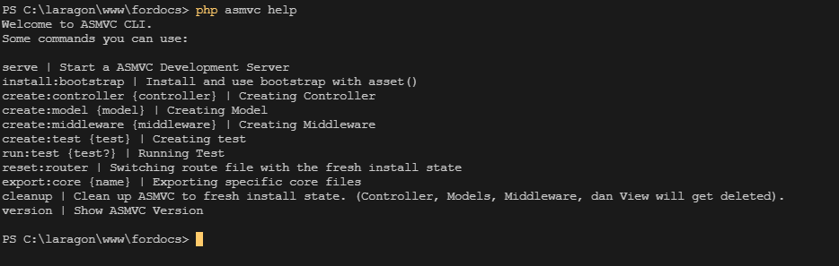

# ASMVC Cli Interface

> ASMVC also have a CLI Interface to help you develop in ASMVC Easier!

## Listing available commands

You can get all ASMVC availble commands by running `php asmvc help`. You should be greeted by this output:

## Understanding the meaning of them

You may wonder what's is `{}` stands for.

This mark `{}` are stands for a parameter.

A required parameter would look like this `{controller}`. Meanwhile a optional parameter would look like this `{test?}`.

> Next: [MVC Structure | Controller](controller.md)
