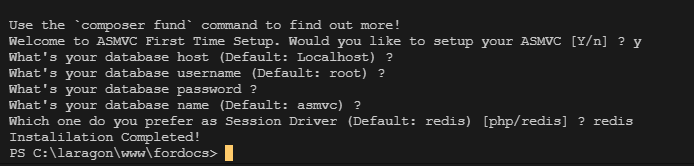

# ENV Configuration

> .env is a file to configure ASMVC to follows your need. ASMVC use [dotEnv](https://github.com/vlucas/phpdotenv) to achive this.

`.env` is not available at the first time you setup this project. But you can copy `.env.example` to `.env`

```text
.
├── .env.example
├── .env
```

> If you greeted by ASMVC First Time Configuration you can type yes and follow the guide so ASMVC can generate `.env` for you:



## Digging what's inside

Your `.env` file should look like this.

```.env
APP_ENV=production

DATABASE_HOST=localhost
DATABASE_USERNAME=root
DATABASE_PASSWORD=
DATABASE_NAME=asmvc

ENTRY_TYPE=controller
ENTRY_CLASS=HomeController
ENTRY_METHOD=index
ENTRY_MIDDLEWARE=

SESSION_TYPE=redis
REDIS_SERVER=127.0.0.1
REDIS_PORT=6379
REDIS_DB_NUMBER=0
REDIS_AUTH_USER=
REDIS_AUTH_PASS=
```

Let's find out every line purpose:

- `APP_ENV`<br>
  In this line you can decide which Application state you are at. Default: `production`. 3 Possible value are:

  - `production`<br>
    Deactivate the error reporting. Shows 500 Internal error if the errors occour. -`testing`<br>
    Use `.env.testing` file to test -`development`<br>
    Enable [`Whoops`](https://github.com/filp/whoops) Error Handling to help you catch the bug

- `DATABASE_HOST`<br>
  Specify where your database hosted. Default: `localhost`.

- `DATABASE_USERNAME`<br>
  Specify what's your username authentication for the database. Default: `root`.

- `DATABASE_PASSWORD`<br>
  Specify what's your authentication password for the database.

- `DATABASE_NAME`<br>
  Specify which database your app are using. Default: `asmvc`.

- `ENTRY_TYPE`<br>
  Specify what's the main entry point going to be. Default: `controller`. Possible value:

  - `controller`<br>
    You can set a controller as main entry point for your app
  - `view`<br>
    You can set a view as main entry point for your app

- `ENTRY_CLASS`<br>
  `ENTRY_CLASS` has 2 purpose. This purpose are dependent on which value you're using for `ENTRY_TYPE`.

  - `controller`<br>
    If your `ENTRY_TYPE` is controller then you should insert a class name of a controller. Default: `HomeController`
  - `view`<br>
    If your `ENTRY_TYPE` is view then you should insert a view path with starting point `App/Views/`.

- `ENTRY_METHOD`<br>
  Just like `ENTRY_CLASS`. `ENTRY_METHOD` also have 2 purpose and it's dependent on `ENTRY_TYPE` value.

  - `controller`<br>
    If your `ENTRY_TYPE` is controller then you should insert a method name of a controller. Default: `index`
  - `view`<br>
    If your `ENTRY_TYPE` is view then you could decide if you want to insert a view data or not.
    Example: `key.value,key2.value2`.
    will equal to:

  ```php
  [ 'key' => 'value', 'key2' => 'value2' ]
  ```

- `ENTRY_MIDDLEWARE`<br>
  Specify the main entry point middleware's class.

- `SESSION_TYPE`<br>
  Specify which session driver to use. Default: `redis`. Possible value are:

  - `redis`<br>
    This will change your session driver to use Redis. Therefore the next following line followed by `REDIS` suffix need to be inserted.
  - `php`<br>
    This will use the default PHP's Session.

- `REDIS_SERVER`<br>
  Specify which ip or address redis running in. Default: `127.0.0.1`.

- `REDIS_PORT`<br>
  Specify which port redis running in. Default: `6379`.

- `REDIS_DB_NUMBER`<br>
  Specify which redis's database to use. Default: `0`.

- `REDIS_AUTH_USER`<br>
  Specify Redis username authenticatioon

- `REDIS_AUTH_PASS`<br>
  Specify Redis password authentication

> Next: [Cli Interface](/clicommands)
