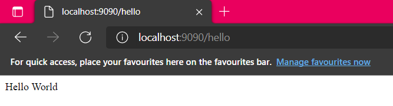

# ASMVC

> ASMVC is a project created by Albet Novendo. Intended for your simple web projects that based on MVC. ASMVC itself is
> a sort of A Simple MVC

> Docs Version: 2.x (BETA)

## Quick Start

> ASMVC Requiresments:

ASMVC needs the following to run:

- PHP 8.0 and up
- Composer

> Supported Technology:

- Database: MySQL
- Web Server: Apache (Mod Rewrite, Override).

> Installing ASMVC

ASMVC can be installed by:

```bash
composer create-project albet/asmvc project-folder-name -s beta
```

> Displaying Hello World

Goto url.php located in below:

```text
.
└── App
    └── Router
        ├── url.php
```

Add following line:

```php
Route::inline("/hello", function() {
    echo "Hello World";
});
```

at the bottom of the `url.php` file.

Now serve the app by running:

```console
php asmvc serve
```

You should be greeted by display like this while you're accessing `localhost:9090/hello` url:



## Migrating from 1.x

> If you're from version 1.x you can follow this guide to upgrade your ASMVC to latest version.

- Create a ASMVC Project with version 2.x.

```bash
composer create-project albet/asmvc project-name -s beta
```

- Copy your controller, models, middleware, and your views (No changes needed).

- Setting up `.env` as follow:

```.env
APP_ENV=development
APP_MODELS_DRIVER=asmvc
APP_CSRF_DRIVER=asmvc
APP_VIEW_ENGINE=asmvc
```

- You're set.

## Migrating to recommended option

> If you're from Version 1.x and chose to use recommended option for migrating. You can follows this tutorial:

- First of all set up your `.env` as follow:

```.env
APP_ENV=development
APP_MODELS_DRIVER=eloquent
APP_CSRF_DRIVER=paragonie
APP_VIEW_ENGINE=latte
```

- And then read this following tutorial:

## Breaking Changes

A New version brings a lot of features. Compared to changes to it's basic code.
2.x More focused in replacement and bug fix. But those replacement has been kept to it's max compability as ever with version 1.

`No Effect`:

Your `.env` file. With the following line:

```.env
ENTRY_TYPE=controller
ENTRY_CLASS=HomeController
ENTRY_METHOD=index
ENTRY_MIDDLEWARE=
```

are unnecessary anymore and unused for ASMVC. The new version's defined on your `url.php`.

> Next: [ENV Configuration](/envconfig)
