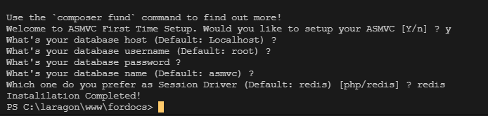

# ENV Configuration

> .env is a file to configure ASMVC to follows your need. ASMVC use [dotEnv](https://github.com/vlucas/phpdotenv) to achive this.

`.env` is not available at the first time you setup this project. But you can copy `.env.example` to `.env`

```text
.
├── .env.example
├── .env
```

> If you greeted by ASMVC First Time Configuration you can type yes and follow the guide so ASMVC can generate `.env` for you:



## Digging what's inside

Your `.env` file should look like this.

```.env
APP_ENV=production
APP_MODELS_DRIVER=asmvc
APP_CSRF_DRIVER=paragonie
APP_VIEW_ENGINE=latte

DATABASE_HOST=localhost
DATABASE_USERNAME=root
DATABASE_PASSWORD=
DATABASE_NAME=asmvc

SESSION_TYPE=redis
REDIS_SERVER=127.0.0.1
REDIS_PORT=6379
REDIS_DB_NUMBER=0
REDIS_AUTH_USER=
REDIS_AUTH_PASS=
```

Let's find out every line purpose:

- `APP_ENV`

  In this line you can decide which Application state you are at. Default: `production`. 3 Possible value are:

  - `production`

  Deactivate the error reporting. Shows 500 Internal error if the errors occour.

  - `testing`

  Use `.env.testing` file to test -`development`

  Enable [`Whoops`](https://github.com/filp/whoops) Error Handling to help you catch the bug

- `APP_MODELS_DRIVER`

  In this line you can decide which model's driver to use. Default: `asmvc`. 2 Possible value are:

  - `asmvc`

  This value is default. Set your models to works just like normal ASMVC [Models](model.md).

  - `eloquent`

  Set your models to use Eloquent driver by default. ["Models Eloquent"](eloquent.md).

- `APP_CSRF_DRIVER`

  In this line you can decide which CSRF's driver you want to use. Default: `paragonie`. 2 Possible value are:

  - `asmvc`

  Set your ASMVC CSRF Driver to simple protection. Provide basic protection against CSRF.

  - `paragonie`

  This value is default. Provide you a advanced protection against CSRF. One time Token per field.

- `APP_VIEW_ENGINE`

  In this line you can decide which View Engine you want to use for ASMVC. 2 Possible value are:

  - `asmvc`

  Set your View Engine to ASMVC. Provide you a simple view engine based on mostly PHP. Details: [View](view.md).

  - `latte`

  This value is default. Provide you a advanced view engine with completely easier syntax.

- `DATABASE_HOST`

  Specify where your database hosted. Default: `localhost`.

- `DATABASE_USERNAME`

  Specify what's your username authentication for the database. Default: `root`.

- `DATABASE_PASSWORD`

  Specify what's your authentication password for the database.

- `DATABASE_NAME`

  Specify which database your app are using. Default: `asmvc`.

- `SESSION_TYPE`

  Specify which session driver to use. Default: `redis`. Possible value are:

  - `redis`

    This will change your session driver to use Redis. Therefore the next following line followed by `REDIS` suffix need to be inserted.

  - `php`

    This will use the default PHP's Session.

- `REDIS_SERVER`

  Specify which ip or address redis running in. Default: `127.0.0.1`.

- `REDIS_PORT`

  Specify which port redis running in. Default: `6379`.

- `REDIS_DB_NUMBER`

  Specify which redis's database to use. Default: `0`.

- `REDIS_AUTH_USER`

  Specify Redis username authenticatioon

- `REDIS_AUTH_PASS`

  Specify Redis password authentication

> Next: [Cli Interface](/clicommands)
